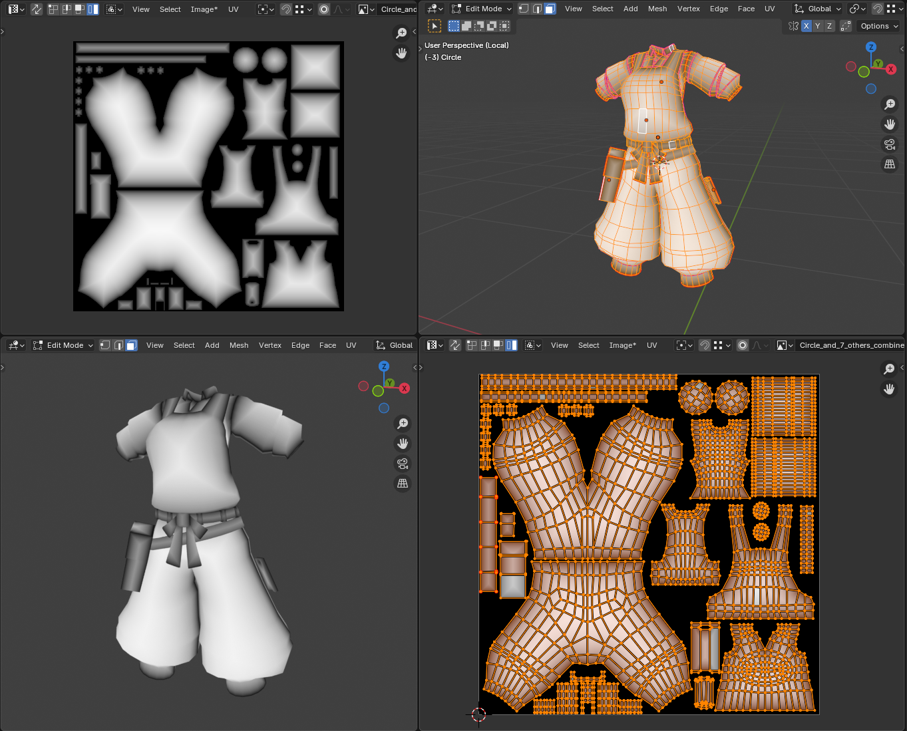

# Blender UV Border Distance Texture Generator

This Blender Python script generates a texture map representing the distance from the borders of UV islands for one or more selected mesh objects. The output is a grayscale image where white areas are furthest from a UV edge (typically the center of a UV island) and black areas are at or near the UV island edges or outside them.



## Requirements

Maybe needed install some package at system 
```bash
sudo pacman -S python-scipy # or your package manager
```

## How to Use

1. donwload and unzip script (or just download this script (or just copy paste))
2. open blender 
3. go to scripting tab (or open text editor window)
4. Text -> Open... -> Choise file (or create new and copy paste)
5. Select mesh object(s)
6. Run script. Should in project appear new image (image datablock) that ends with "_uv_distance" (Circle_and_7_others_combined_uv_distance or Plane.003_uv_distance)

## Configuration

All settings are controlled by modifying the `TextureGenConfig`.

```python
config = TextureGenConfig()
config.resolution = 1024*4  
config.falloff_rate = 3.0   
config.smoothness = 1.2     
# etc... check script
```
